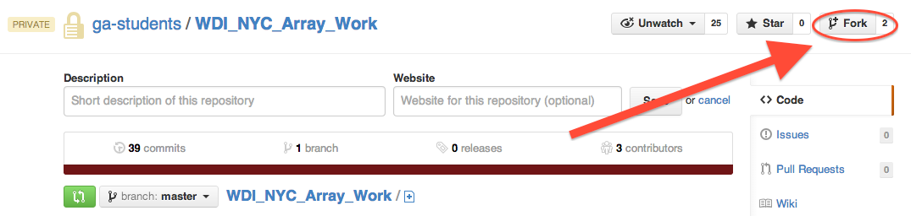
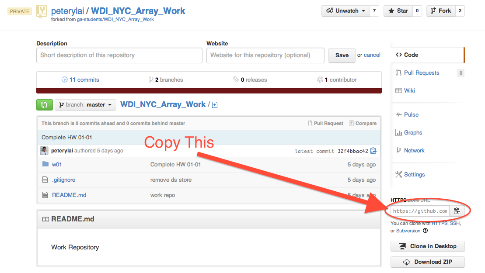
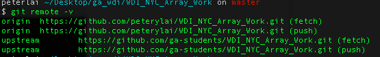

Web Development Immersive - WORK REPOSITORY
============================

##HOW TO SET UP YOUR GITHUB CLASS WORK REPOSITORY

* You should start by forking this repo


* Copy the clone url for YOUR fork


* Go to your terminal, make sure that you are in your `/dev/wdi` directory

* From the terminal, clone by typing:

```bash
git clone YOUR_CLONE_URL
```
For example mine would look like this:

```bash
git clone https://github.com/peterylai/WDI_NYC_Array_Work.git
```

* cd into your `WDI_NYC_Array_Work` directory

```bash
cd WDI_NYC_Array_Work
```

* Verify you added the remote by typing:

```bash
git remote -v
```


* Add our main repository as "upstream"

```bash
git remote add upstream https://github.com/ga-students/WDI_NYC_Array_Work.git
```

* Verify you added the remote by typing:

```bash
git remote -v
```


### NEXT
* Move on to the [First_Submission_Instructions](First_Submission_Instructions/)

###How Do I Get Files From GitHub?

Periodically, we'll be posting new assignments and exercises. To get these files, __pull__ (download) them from the instructor's repository (upstream).

From the terminal type:
(make sure you are in the correct directory)

```bash
git pull upstream master
```
